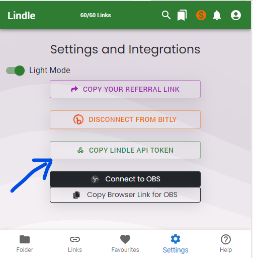

# Lindle Java/Kotlin/Maven
Lindle is your ultimate solution for managing and organizing your web links with ease. This versatile Chrome extension empowers you to save, categorize, and access your online resources like never before.

<a href="https://www.buymeacoffee.com/m2kdevelopments" target="_blank">

</a>

<a href="https://play.google.com/store/apps/details?id=com.m2kdevelopments.lindle" target="_blank">
    
</a>
<a href="https://chrome.google.com/webstore/detail/igkkojjaikfmiibedalhgmfnjohlhmaj" target="_blank">
    
</a>


## API Documentation
The <a href="https://lindle.me/api-docs">API</a> Documentation for Lindle.


## Installation for Maven
Copy this in dependencies in pom.xml in your Maven project
```
<!-- https://mvnrepository.com/artifact/com.m2kdevelopments.lindle -->
<dependency>
    <groupId>com.m2kdevelopments</groupId>
    <artifactId>lindle</artifactId>
    <version>1.0-SNAPSHOT</version>
</dependency>
```

## Installation for Gradle
Copy this to the dependencies section in gradle file
```
// https://mvnrepository.com/artifact/com.m2kdevelopments.lindle
implementation group: 'com.m2kdevelopments.lindle', name: 'gson', version: '2.10.1'
```


## Getting Started
Get your Lindle API key from <a href="https://chrome.google.com/webstore/detail/igkkojjaikfmiibedalhgmfnjohlhmaj">Chrome Extension</a>.
<br/>


```
String apiKey = "Your API KEY";
String lindle = new Lindle(apiKey);
```

Use a json library like <a href="https://mvnrepository.com/artifact/com.google.code.gson/gson/2.10.1">Gson</a> to convert the string into json

## Get Links
```
String links = lindle.getLinks();
System.out.println(links);
```


## Get Folders
```
String folders = lindle.getFolders();
System.out.println(folders);
```

## Get Synced Bookmarks
```
String bookmarkData = lindle.getSyncedBookmarks();
System.out.println(bookmarkData);
```